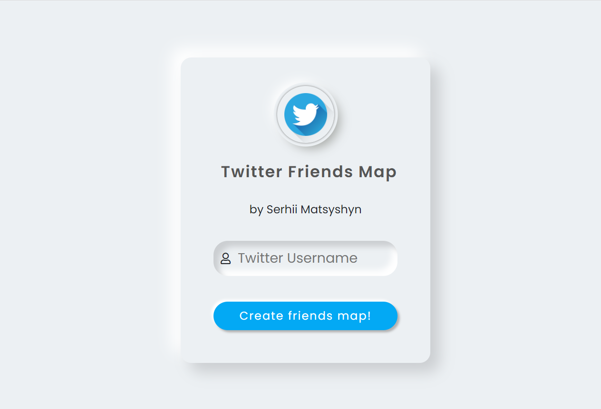
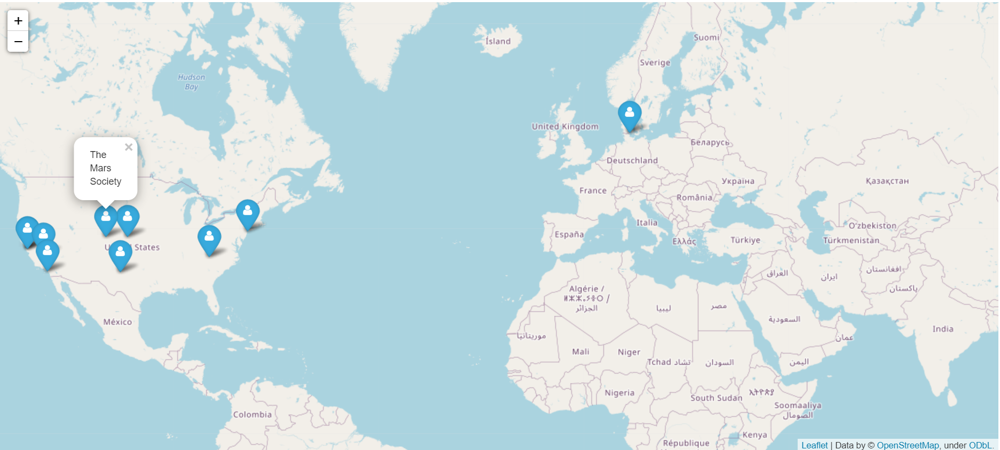
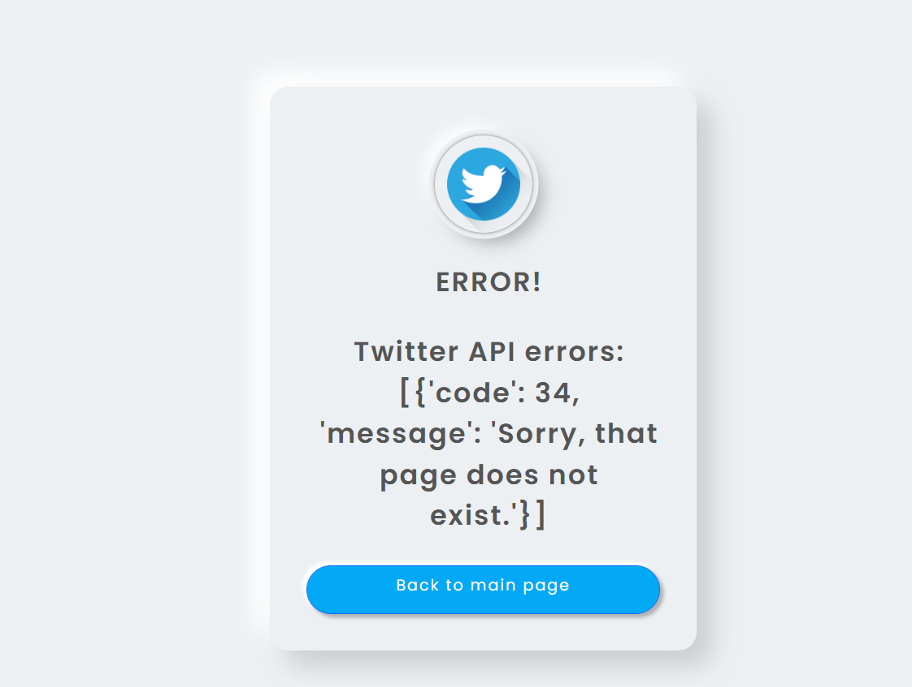

# Twitter friends map

Site that creates map with locations of Twitter friends (up to 200 friends for quicker map generation) of provided account.  
It is built with the use of Flask, Folium, Geopy and Twitter API.

Link to the site: https://FriendsMap.pythonanywhere.com/
## Installation

Install the requirements:

```bash
pip install -r requirements.txt
```
Add environment variable SECRET_TWITTER_API_BEARER_TOKEN with your Twitter API bearer token.  
Instruction on how to do it: https://help.pythonanywhere.com/pages/environment-variables-for-web-apps/

Main Flask file - friends_site.py
## Usage

On the index page you can enter the Twitter account username and press "Create friends map!" button.  


Then in some minutes (**map generation can take some time**) you will be redirected to the page with generated map.  


If something goes wrong you will be redirected to Error page.  


